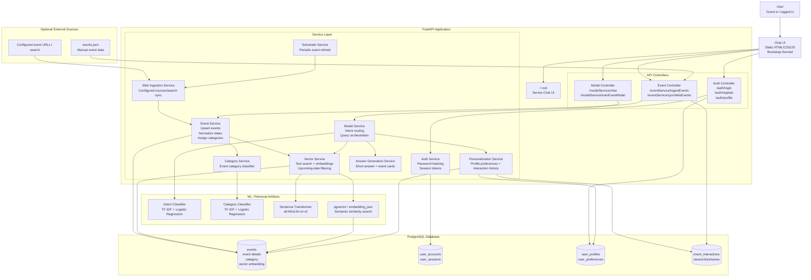

# getAHint Architecture Diagram

## Project Flow

1. **User Access**
   - User opens the root URL.
   - The app first asks the user to choose Guest Mode or User Mode.
   - Guest users continue directly to chat.
   - User Mode requires login or registration, then loads profile preferences.

2. **Data Ingestion**
   - Admin ingests event data through `/eventService/ingestEvents`.
   - Events are normalized, categorized, and saved into PostgreSQL.
   - Optional web sync can refresh event data periodically through the scheduler.

3. **Training / Indexing**
   - `/modelService/trainEventModel` trains the intent classifier, trains the category classifier, categorizes existing events, and generates embeddings.
   - Event embeddings are stored in PostgreSQL using `pgvector` when available.

4. **Chat Query Processing**
   - The chat message is classified as greeting/help/feedback/event query.
   - Event queries use hybrid retrieval:
     - database text matching
     - vector similarity search
     - category matching
     - upcoming-date filtering

5. **Personalization**
   - Logged-in users can save profile preferences such as preferred categories.
   - The UI tracks event card views and "show details" interactions.
   - Recommendations are reranked using saved preferences and interaction history.

6. **Response Generation**
   - The backend returns a short answer summary and matching event records.
   - The UI displays results as compact cards.
   - Full event details appear only when the user clicks a card.

